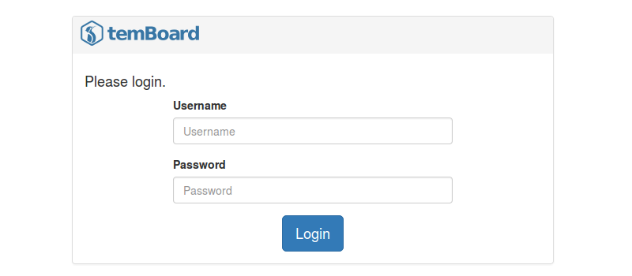
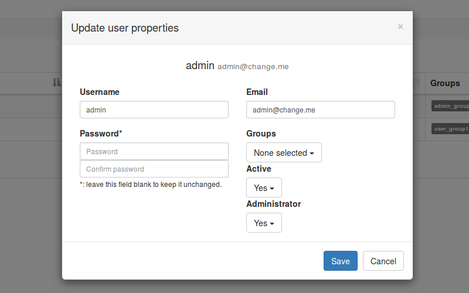
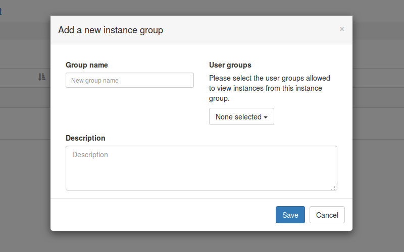

# temBoard UI howto

## First connection

Once `temboard` is up and running, it's time to try a first connection to the web interface with a web browser using `https` at the address `https://<temboard-host>:8888/`.



You should get a login box. The default administration account is `admin`, the password is `admin`. Obviously, this password **MUST** be changed as soon as possible. To edit user's profile, please login and go to `Manage` -> `User list` then `Edit` on the corresponding row.



Currently, when a logged in user changes its password, the error message `Restricted area...` is raised, this behaviour is due to the expiration of user session when the password has been changed. Go back to the login page and fill the form with the new password.


# User and user group creation

User acces controls to instances managed by `temboard` are based on `group` belonging. Each `instance` can belong to *N* `instance group`, each `user` can belong to *N* `user group`. Each `user group` is granted or not to acces an `instance group`.
You must be logged in with a user having administration privileges to manage `users`.

## User group creation

Go to `Manage`-> `User groups`, then `+ Add a new user group`. Please fill the form and `Save`.


### User group attributes

  * `Groupe name`: Groupe name, must be unique;
  * `Description`: Group description.

## User creation

To add a new `user`, go to `Manage` -> `Users`, then `+ Add a new user`.


### User attributes

  * `Username`: User name used for login, must be unique;
  * `Password`: User password;
  * `Email`: User email address;
  * `Groups`: `user groups` list the user belongs to;
  * `Active`: Is the user active or not, if not he won't be able to login;
  * `Administrator`: Does the user get administration rights to create other users, instances etc..

# Add a new instance

You must be logged in with a user having administration privileges.

## Create a new instance group

To create a new `instance group`, go to `Manage` -> `Instance groups`, then `+ Add a new instance group`.



### Instance group attributes

  * `Group name`: Groupe name, must be unique;
  * `Description`: Groupe description;
  * `User Groups`: List of `user group` allowed to acces `instances` from this `instance group`.

## Create a new instance

### Agent setup

Before adding a new instance in `temboard` interface, you'd check that `temboard-agent` is up & running on the machine hosting the PostgreSQL instance.
A quick smoke test can be done using `curl` from `temboard` machine:
```
curl https://<temboard-agent-address>:2345/discover

{"hostname": "debian-tbd-agent.local", "pg_data": "/var/lib/postgresql/9.5/main", "pg_port": 5432, "plugins": ["monitoring", "dashboard", "settings", "administration", "activity"], "memory_size": 518451200, "pg_version": "PostgreSQL 9.5.4 on x86_64-pc-linux-gnu, compiled by gcc (Debian 4.9.2-10) 4.9.2, 64-bit", "cpu": 1}
```

#### `monitoring` plugin

The `monitoring` plugin from `temboarg-agent` is in charge to collect system and PostgreSQL metrics about the host is running on. Periodicaly, these data (JSON object) are sent to `temboard` using an `https` API. To allow this data flow, a key must be built and shared between `temboard` and the `temboard-agent`.

  * On the agent side, the key has to be set in `temboard-agent.conf` file, under the `[temboard]` section, the parameter is `key`. Configuration must be reloaed.
  * On `temboard` UI side, you have to edit the corresponding `instance` and set the same key in `Agent key` field.

See `doc/temboard-agent-configuration.md` for more information.

#### Agent users

In order to use most of the plugins, one or more `user` must be added to each `tembaord-agent`. Once the `temboard-agent` is well configured, you can use the script `temboard-agent-adduser` to create a new `user`:
```
sudo -u postgres temboard-agent-adduser

Username: john
Password: 
Retype password: 
Done.
```

Testing login with this new user can be done using `curl` tool:
```
curl -k -X POST --data '{"username": "john", "password": "xxxxx"}' https://127.0.0.1:2345/login

{"session": "fe43c3973ec7ca0fc219c00588c97c39afc06fcf91ee1203d19a892466600dae"}
```

### Add a new instance

There are two ways for adding a new instance in Temboard UI:
  * using the UI itself and its online form;
  * using the script `temboard-agent-register` from the host running the agent.


### From the UI

Go to `Manage` -> `Instances`, then `+ Add a new instance`.


### Instance attributes

  * `Agent address`: IPv4 address that the agent is listening on; 
  * `Agent port`: Port number that the agent is listening on;
  * `Agent secret key`: Authentication key used by the agent to send data to the collector (`monitoring` plugin only);
  * `Groups`: Instance groups this instance belongs to.
  * `Active plugins`: `plugins` enabled for this instance. Selected `plugins` must be loaded by the `agent` too.

Once `Agent address` and `Agent port` filled, if the `agent` is up & running, it's possible to retreive values of the following attributes by clicking on the button `Get instance's informations`.

  * `Number of CPU`: Number of CPU/vCPU;
  * `Memory size`: Memory size in bytes;
  * `Hostname`: Machine hostname, FQDN. Must be unique.
  * `PostgreSQL data directory`
  * `PostgreSQL port`
  * `PostgreSQL version`

## From the command line with `temboard-agent-register`

This script tries to ease instance/agent registration to Temboard UI.

Requirements:
  * having an agent configured;
  * `temboard-agent` must be running;
  * having an HTTPS flow open between the host running the agent and the host running the UI (default port: `8888`);
  * having a user with admin. rights to Temboard UI.

`temboard-agent-register` should be executed from the host running the agent we want to register and works following these steps:
  - Agent configuration loading;
  - Data collection about the environnement, using agent's /discover API;
  - Login to the UI;
  - Send collected data about the instance/agent to the UI for registration.

Usage:
```
Usage: temboard-agent-register [options] <https-temboard-ui-address>

Register a couple PostgreSQL instance/agent to a Temboard UI.

Options:
  -c CONFIGFILE, --config=CONFIGFILE
                        Configuration file. Default: /etc/temboard-agent
                        /temboard-agent.conf
  -h HOST, --host=HOST  Agent address. Default: localhost
  -p PORT, --port=PORT  Agent port. Default: 2345
  -g GROUPS, --groups=GROUPS
                        Instance groups list, comma separated. Default: none
  --help                Show this help message and exit.

```

Exemple:
```
temboard-agent-register --groups=instance_group https://ui.temboard.local:8888
```
