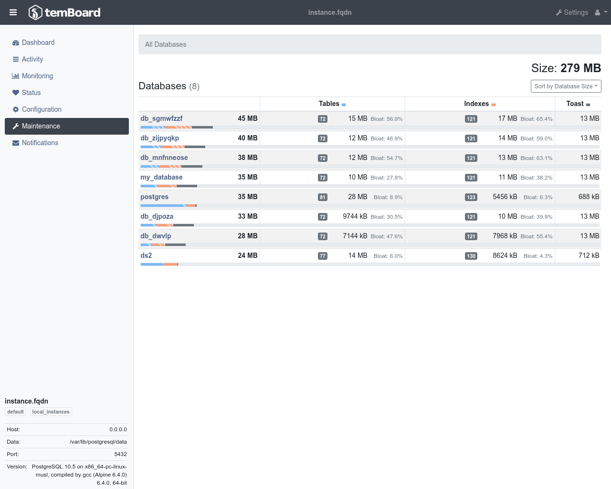
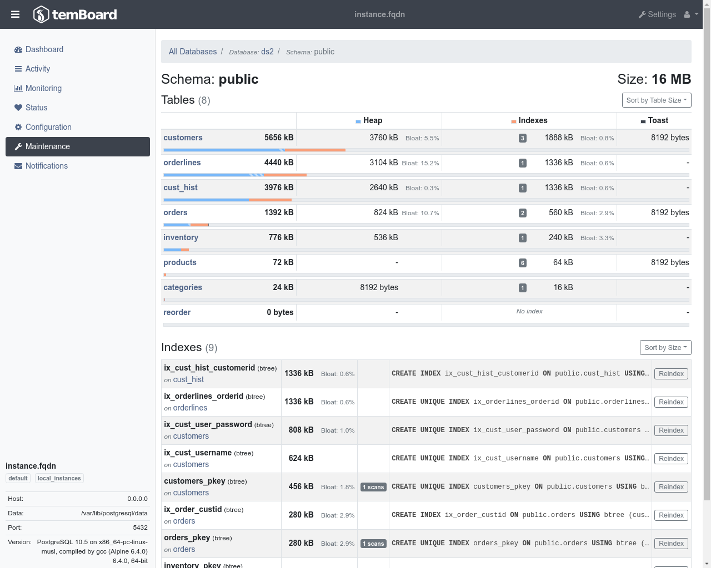
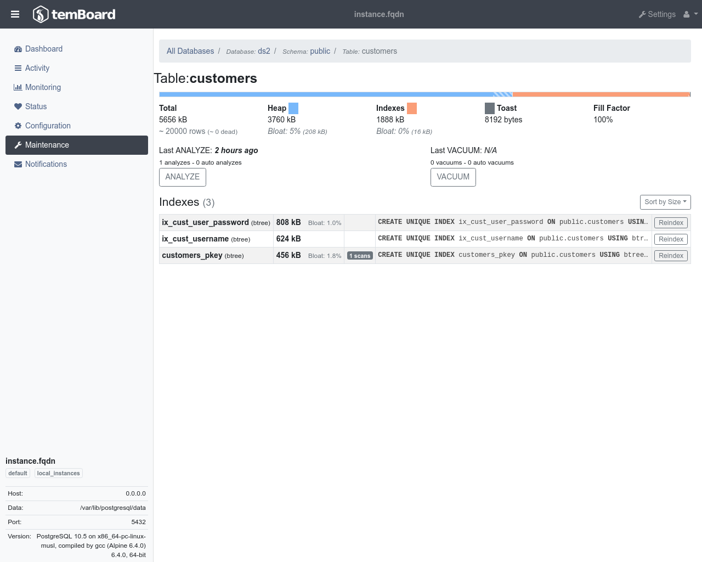
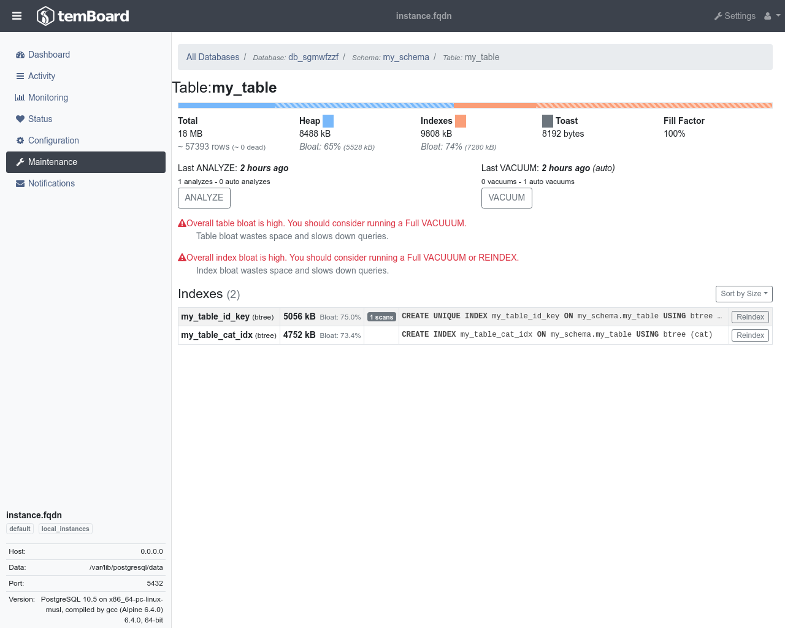
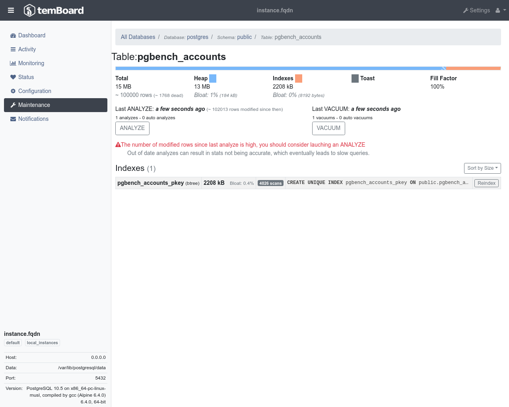
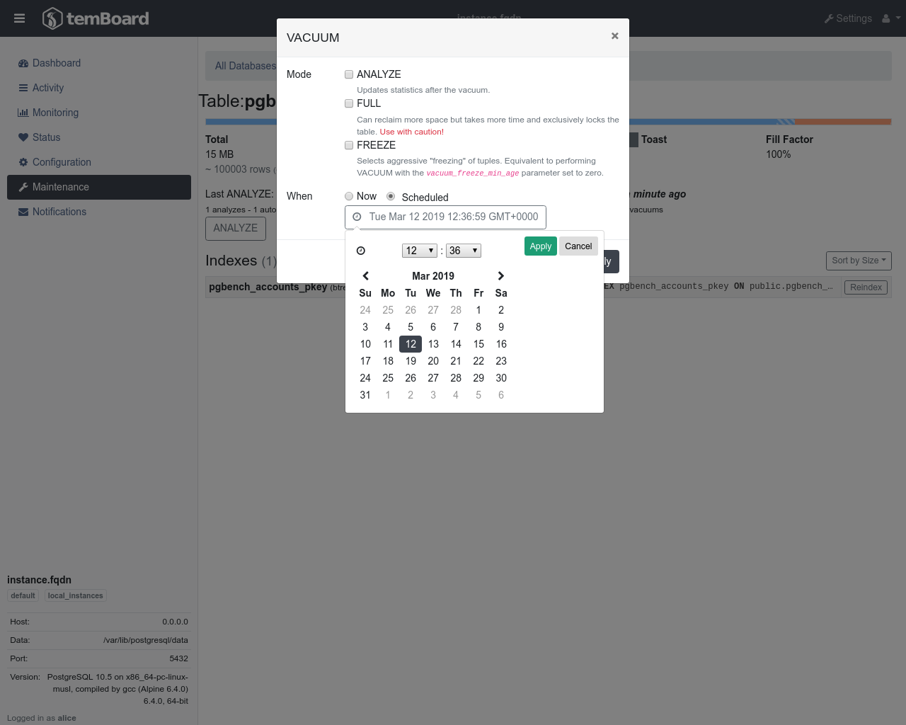

# Maintenance

The aim of the *maintenance* plugin is to give the users an overview on the
**databases**, **schemas**, **tables** or **indexes** respective **size**.

It's very useful to get information about **bloat** and **toast**. It can help users
determine potential issues and understand or prevent performance issues due to
unaccordingly used space.

The plugin also provides easy access to maintenance actions such as **VACUUM**,
**ANALYZE** or **REINDEX** in order to fix space or performances problems.

!!! note

    Please beware that the values for bloat, toast, etc… are estimated.
    They may not perfectly reflect the reality especially if there hasn't been
    any analyze performed recently.

## Views

The maintenance plugin lets you navigate through databases, schemas and tables
of the instance.

The page for one table shows more detailed information.

## Hints

Once in a while temBoard may be able to provide some hints on actions to
perform on tables or indexes.

Here are some screenshots on what the alerts could look like:

## Maintenance actions

If you're logged onto the agent, you may then be able to perform actions by
clicking on the dedicated buttons.

temBoard can let you launch different actions such as **ANALYZE**, **VACUUM** or
**REINDEX**

You can also choose either to launch the action immediately or in the future
at the date and time you decide.

